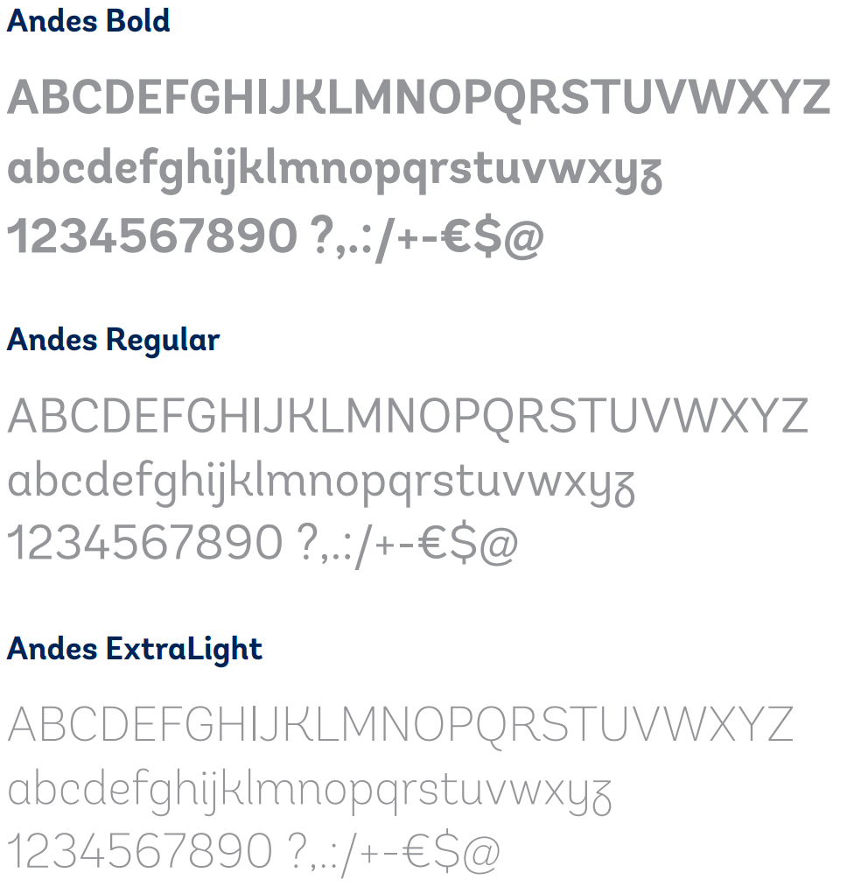
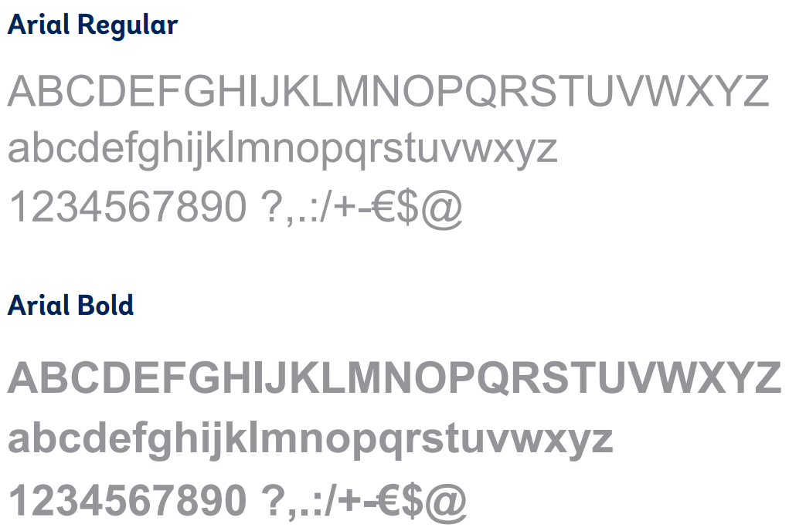

# Table of Contents

1.  [<code>[1/2]</code> Dataset](#org673b810)
    1.  [Variables](#org5b7189b)
    2.  [<code>[1/11]</code> Data sources](#org87f6c00)
        1.  [`Decade`](#org2a32d1e)
        2.  [`UN_Geosheme_Subregion`](#org17e70d1)
        3.  [`Disaster_Type`](#org76496c1)
        4.  [`RCP`](#org9e4e2a4)
        5.  [`#LoDO`](#orga9982b2)
        6.  [`#MeDO`](#org0c6b7c8)
        7.  [`#HiDO`](#org57a9fda)
        8.  [`Human_Impact`](#orgd273436)
        9.  [`Financial_Impact`](#orga20e125)
        10. [`°C`](#org2c67779)
        11. [`Geo`](#orga9ace4c)
2.  [<code>[1/2]</code> Prototyping](#org48d37e4)
    1.  [Features](#org00355e9)
    2.  [<code>[1/3]</code> Wireframe](#org182cef3)
        1.  [World map](#org39c34b1)
        2.  [Sub region pop-up](#org8c9eeb3)
        3.  [World figures](#org9962e1a)
3.  [<code>[1/3]</code> Development](#orgde9db58)
    1.  [Why did we pick Dash?](#org7be27e7)
    2.  [<code>[2/3]</code> Visual identity guidelines](#org810f43b)
        1.  [Colors](#orgbdedb83)
            -   [Primary colors](#org8abf23b)
            -   [Secondary colors](#org8dd7cb7)
        2.  [Fonts](#orgba509ce)
            -   [Primary fonts](#orgedc2313)
            -   [Secondary fonts](#orgae283df)
        3.  [Logo](#orge9a92f7)
    3.  [Architecture](#orgcb14b16)
        1.  [`app.py`](#orgbc60f68)
        2.  [`assets/style.css`](#org9b1a2ca)
        3.  [`assets/WB_logo.jpg`](#org480c632)
4.  [<code>[1/3]</code> Project Management](#org5c565c5)
    1.  [Methodology](#orgc118cce)
    2.  [tools](#org991af8c)
    3.  [How to contribute](#org3aa0b50)
        1.  [Setting up a new Git repository](#org457775f)
        2.  [Adding or modifying owned files (`push`)](#org70a08d7)
        3.  [Submit proposed changes to review](#org4bfb48c)
        4.  [Adding reviewed files (`merge`)](#org8b3aa00)

Todo : upload a screenshot of the delivered dashboard

# STARTED <code>[1/2]</code> Dataset

## DONE Variables

<table border="2" cellspacing="0" cellpadding="6" rules="groups" frame="hsides">

<colgroup>
<col  class="org-left" />

<col  class="org-left" />

<col  class="org-left" />
</colgroup>
<thead>
<tr>
<th scope="col" class="org-left">Variable name</th>
<th scope="col" class="org-left">Data type</th>
<th scope="col" class="org-left">Description/Example</th>
</tr>
</thead>

<tbody>
<tr>
<td class="org-left">`Decade`</td>
<td class="org-left">int64</td>
<td class="org-left">1900, 1910, &#x2026;, 2080, 2090</td>
</tr>

<tr>
<td class="org-left">`UN_Geosheme_Subregion`</td>
<td class="org-left">str</td>
<td class="org-left">'Australia and New Zealand', 'Caribbean', etc.</td>
</tr>

<tr>
<td class="org-left">`Disaster_Type`</td>
<td class="org-left">str</td>
<td class="org-left">Either 'Floods', 'Droughts' or 'Storms'</td>
</tr>

<tr>
<td class="org-left">`RCP`</td>
<td class="org-left">float64</td>
<td class="org-left">NaN for the past, either 2.6, 4.5, 6.0 or 8.5 for the future</td>
</tr>

<tr>
<td class="org-left">`#LoDO`</td>
<td class="org-left">int64</td>
<td class="org-left">Provides the number of low impact disasters<a id="fnr.1" class="footref" href="#fn.1">1</a>.</td>
</tr>

<tr>
<td class="org-left">`#MeDO`</td>
<td class="org-left">int64</td>
<td class="org-left">Provides the number of medium impact disasters<a id="fnr.1.100" class="footref" href="#fn.1">1</a>.</td>
</tr>

<tr>
<td class="org-left">`#HiDO`</td>
<td class="org-left">int64</td>
<td class="org-left">Provides the number of high impact disasters<a id="fnr.1.100" class="footref" href="#fn.1">1</a>.</td>
</tr>

<tr>
<td class="org-left">`Human_Impact`</td>
<td class="org-left">int64</td>
<td class="org-left">Provides the number of impacted people<a id="fnr.1.100" class="footref" href="#fn.1">1</a>.</td>
</tr>

<tr>
<td class="org-left">`Financial_mpact`</td>
<td class="org-left">int64</td>
<td class="org-left">Provides the financial impact<a id="fnr.1.100" class="footref" href="#fn.1">1</a>.</td>
</tr>

<tr>
<td class="org-left">`°C`</td>
<td class="org-left">int64</td>
<td class="org-left">Provides the temperature in Celsius degrees<a id="fnr.2" class="footref" href="#fn.2">2</a></td>
</tr>

<tr>
<td class="org-left">`Geo`</td>
<td class="org-left">GeoPandas</td>
<td class="org-left">Geospatial data delimitating geoscheme sub regions on the map</td>
</tr>
</tbody>
</table>

## STARTED <code>[1/11]</code> Data sources

### DONE `Decade`

    Decade = [1900, 1910, 1920, 1930, 1940, 1950, 1960, 1970, 1980, 1990, 2000, 2010,2020,2030,2040,2050,2060,2070,2080,2090]

For example `2020` starts in 2020 and ends in 2029

### STARTED `UN_Geosheme_Subregion`

    UN_Geosheme_Subregion = ['Australia and New Zealand','Caribbean','Central America','Central Asia','Eastern Africa','Eastern Asia','Eastern Europe','Melanesia','Micronesia','Middle Africa','Northern Africa','Northern America','Northern Europe','Polynesia','South America','South-Eastern Asia','Southern Africa','Southern Asia','Southern Europe','Western Africa','Western Asia','Western Europe']

Todo : sum up

-   <https://en.wikipedia.org/wiki/United_Nations_geoscheme>
-   <https://en.wikipedia.org/wiki/UN_M49>
-   <https://unstats.un.org/unsd/methodology/m49/>

and provide links as sources  

### STARTED `Disaster_Type`

    Disaster_Type = ['Droughts', 'Floods', 'Storms']

Todo : link to github respective workstream pages

### STARTED `RCP`

    RCP = [2.6,4.5,6.0,8.5]

TODO : sum up <https://en.wikipedia.org/wiki/Representative_Concentration_Pathway> and provide link as source

### BACKLOG `#LoDO`

Todo : link to github respective workstream pages

### BACKLOG `#MeDO`

Todo : link to github respective workstream pages

### BACKLOG `#HiDO`

Todo : link to github respective workstream pages

### BACKLOG `Human_Impact`

Todo : link to github respective workstream pages

### BACKLOG `Financial_Impact`

Todo : link to github respective workstream pages

### BACKLOG `°C`

Todo : provide link and explain : <https://climateknowledgeportal.worldbank.org/download-data>

### BACKLOG `Geo`

Todo : explain

# BACKLOG <code>[1/2]</code> Prototyping

## DONE Features

<table border="2" cellspacing="0" cellpadding="6" rules="groups" frame="hsides">

<colgroup>
<col  class="org-left" />

<col  class="org-left" />
</colgroup>
<thead>
<tr>
<th scope="col" class="org-left">Feature name</th>
<th scope="col" class="org-left">Description</th>
</tr>
</thead>

<tbody>
<tr>
<td class="org-left">Main layout</td>
<td class="org-left">Organise features and widgets on the main page</td>
</tr>

<tr>
<td class="org-left">World map</td>
<td class="org-left">Displays the world map, with UN sub regions</td>
</tr>

<tr>
<td class="org-left">World map dataviz</td>
<td class="org-left">Displays data on the worldmap, with a legend</td>
</tr>

<tr>
<td class="org-left">RCP thermometer</td>
<td class="org-left">To choose among the 4 RCP</td>
</tr>

<tr>
<td class="org-left">Disaster toggle</td>
<td class="org-left">To choose among 1 over 3 disaster type</td>
</tr>

<tr>
<td class="org-left">Impact toggle</td>
<td class="org-left">To choose between human or financial impact</td>
</tr>

<tr>
<td class="org-left">Selectable timeframe</td>
<td class="org-left">To choose from 1 to 20 decades</td>
</tr>

<tr>
<td class="org-left">Sub region mouseover</td>
<td class="org-left">Mouseover on a sub region triggers a popup</td>
</tr>

<tr>
<td class="org-left">Sub region popup</td>
<td class="org-left">Shows region's figures</td>
</tr>

<tr>
<td class="org-left">World figures</td>
<td class="org-left">Shows world figures</td>
</tr>

<tr>
<td class="org-left">World figures expand</td>
<td class="org-left">Button that triggers world figures popup</td>
</tr>

<tr>
<td class="org-left">World figures popup</td>
<td class="org-left">Expends world figures additional figures</td>
</tr>

<tr>
<td class="org-left">Play/Pause toggle</td>
<td class="org-left">launch a per decade animation on the world map</td>
</tr>
</tbody>
</table>

## BACKLOG <code>[1/3]</code> Wireframe

### DONE World map

### BACKLOG Sub region pop-up

### BACKLOG World figures

# STARTED <code>[1/3]</code> Development

## DONE Why did we pick [Dash](https://plotly.com/dash/)?

As we wanted to use Python to build the Dashboard we had to pick among [Python dashboard libraries](https://pyviz.org/tools.html) :

According to following benchmarck the team decided to develop the PoC with ****Dash****

<table border="2" cellspacing="0" cellpadding="6" rules="groups" frame="hsides">

<colgroup>
<col  class="org-left" />

<col  class="org-left" />

<col  class="org-left" />

<col  class="org-left" />

<col  class="org-left" />
</colgroup>
<thead>
<tr>
<th scope="col" class="org-left">&#xa0;</th>
<th scope="col" class="org-left">Maturity</th>
<th scope="col" class="org-left">Popularity</th>
<th scope="col" class="org-left">Simplicity</th>
<th scope="col" class="org-left">Adaptability</th>
</tr>
</thead>

<tbody>
<tr>
<td class="org-left">Streamlit</td>
<td class="org-left">C</td>
<td class="org-left">A</td>
<td class="org-left">A</td>
<td class="org-left">C</td>
</tr>

<tr>
<td class="org-left">Dash</td>
<td class="org-left">B</td>
<td class="org-left">A</td>
<td class="org-left">B</td>
<td class="org-left">B</td>
</tr>

<tr>
<td class="org-left">Voila</td>
<td class="org-left">C</td>
<td class="org-left">C</td>
<td class="org-left">A</td>
<td class="org-left">C</td>
</tr>
</tbody>
</table>

****Maturity****: Based on the age of the project and how stable it is.

****Popularity****: Based on adoption and GitHub stars.

****Simplicity****: Based on how easy it is to get started using the library.

****Adaptability****: Based on how flexible and opinionated the library is.

## STARTED <code>[2/3]</code> Visual identity guidelines

We will follow World Bank's visual identity guidelines for colors and fonts.

### DONE Colors

#### Primary colors

<table border="2" cellspacing="0" cellpadding="6" rules="groups" frame="hsides">

<colgroup>
<col  class="org-left" />

<col  class="org-left" />
</colgroup>
<thead>
<tr>
<th scope="col" class="org-left">Name</th>
<th scope="col" class="org-left">Hex code</th>
</tr>
</thead>

<tbody>
<tr>
<td class="org-left">Sapphire blue</td>
<td class="org-left">#002244</td>
</tr>

<tr>
<td class="org-left">Sky blue</td>
<td class="org-left">#009FDA</td>
</tr>

<tr>
<td class="org-left">Black</td>
<td class="org-left">#000000</td>
</tr>

<tr>
<td class="org-left">White</td>
<td class="org-left">#FFFFFF</td>
</tr>
</tbody>
</table>

#### Secondary colors

<table border="2" cellspacing="0" cellpadding="6" rules="groups" frame="hsides">

<colgroup>
<col  class="org-left" />

<col  class="org-left" />
</colgroup>
<thead>
<tr>
<th scope="col" class="org-left">Family</th>
<th scope="col" class="org-left">Hex code</th>
</tr>
</thead>

<tbody>
<tr>
<td class="org-left">Brighter Warm</td>
<td class="org-left">F05023</td>
</tr>

<tr>
<td class="org-left">Brighter Warm</td>
<td class="org-left">FDB714</td>
</tr>

<tr>
<td class="org-left">Brighter Warm</td>
<td class="org-left">2EB1C2D</td>
</tr>

<tr>
<td class="org-left">Brighter Warm</td>
<td class="org-left">F78D28</td>
</tr>

<tr>
<td class="org-left">Brighter Cool</td>
<td class="org-left">009CA7</td>
</tr>

<tr>
<td class="org-left">Brighter Cool</td>
<td class="org-left">00AB51</td>
</tr>

<tr>
<td class="org-left">Brighter Cool</td>
<td class="org-left">872B90</td>
</tr>

<tr>
<td class="org-left">Brighter Cool</td>
<td class="org-left">00A996</td>
</tr>

<tr>
<td class="org-left">Muted Warm</td>
<td class="org-left">98252B</td>
</tr>

<tr>
<td class="org-left">Muted Warm</td>
<td class="org-left">E16A2D</td>
</tr>

<tr>
<td class="org-left">Muted Warm</td>
<td class="org-left">B88C1D</td>
</tr>

<tr>
<td class="org-left">Muted Cool</td>
<td class="org-left">614776</td>
</tr>

<tr>
<td class="org-left">Muted Cool</td>
<td class="org-left">006068</td>
</tr>

<tr>
<td class="org-left">Muted Cool</td>
<td class="org-left">006450</td>
</tr>
</tbody>
</table>

### DONE Fonts

#### Primary fonts

#### Secondary fonts

### BACKLOG Logo

## BACKLOG Architecture

Todo : describe files

### `app.py`

### `assets/style.css`

### `assets/WB_logo.jpg`

# STARTED <code>[1/3]</code> Project Management

## BACKLOG Methodology

## BACKLOG tools

-   Notion
-   Slack
-   Zoom

## DONE How to contribute

### Setting up a new Git repository

-   Clone project locally
    
        $ git init
        $ git clone https://github.com/dataforgoodfr/batch8_worldbank/tree/master/plateforme
-   Ask to join our GitHub

### Adding or modifying owned files (`push`)

When adding a new file or modifying a file that you own, do:

    $ git add filename
    $ git commit
    $ git push

Where `filename` is the name of the file

### Submit proposed changes to review

When modifying an existing file, if you're not its owner, you have to submit the modifications to its owner (i.e. reviewer). Ownership is distributed as follow :

<table border="2" cellspacing="0" cellpadding="6" rules="groups" frame="hsides">

<colgroup>
<col  class="org-left" />

<col  class="org-left" />
</colgroup>
<thead>
<tr>
<th scope="col" class="org-left">Owner GitHub name</th>
<th scope="col" class="org-left">File</th>
</tr>
</thead>

<tbody>
<tr>
<td class="org-left">mahdiqb</td>
<td class="org-left">`./app.py`</td>
</tr>

<tr>
<td class="org-left">morgandavidson</td>
<td class="org-left">`./README.md`</td>
</tr>

<tr>
<td class="org-left">alencon</td>
<td class="org-left">`./asset/style.css`</td>
</tr>
</tbody>
</table>

To submit changes reviewees have to do: 

    $ git add filename
    $ git commit
    $ hub pull-request -h revieweename:master -b dataforgoodfr:master -m -r reviewername -f

Where `revieweename` and `reviewername` are the GitHub names of the reviewee and the reviewer/owner.

### Adding reviewed files (`merge`)

-Reviewers have to do 

    $ hub merge PRurl 

Where `PRurl` is the url of the pull request.

# Footnotes

<a id="fn.1" href="#fnr.1">1</a> Given a disaster, a decade, a region, and a climate scenario

<a id="fn.2" href="#fnr.2">2</a> Given a decade, a region, and a climate scenario.
